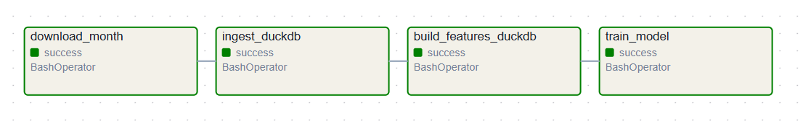
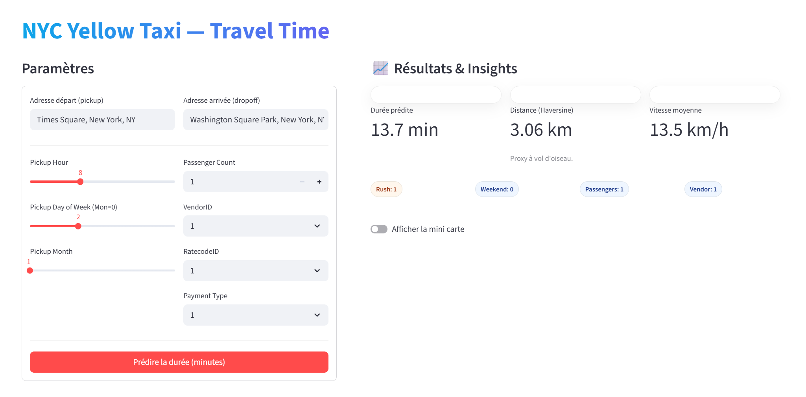

# NYC Taxi Data Pipeline

## Objectif

Ce projet illustre un **pipeline complet de données** appliqué aux trajets NYC Yellow Taxi.  
Il met en œuvre :  
- ingestion des données brutes,  
- création de features avec DuckDB,  
- entraînement d’un modèle de Machine Learning,  
- et une **application Streamlit** pour tester la prédiction de durée de trajet.  

L’ensemble est orchestré dans **Apache Airflow**, et dockerisé pour être reproductible.


## Dataset

- **Nom** : NYC Yellow Taxi Trips  
- **Période utilisée** : janvier 2023 (échantillon pour test)  
- **Source** : [NYC TLC Open Data](https://www.nyc.gov/site/tlc/about/tlc-trip-record-data.page)  
- **Champs utilisés** : heure de pickup, coordonnées pickup/dropoff, distance, vendor, payment type, passenger count.  


## Architecture

```
NYC-TAXI-PIPELINE/
│
├── airflow/                # DAG Airflow
│   └── dags/nyc_taxi_duckdb_pipeline.py
├── configs/                # Paramètres (config.yaml)
├── src/                    # Code applicatif
│   ├── ingest.py           # Télécharge les données brutes
│   ├── ingest_duckdb.py    # Ingestion dans DuckDB
│   ├── features_duckdb.py  # Construction des features
│   ├── train.py            # Entraînement du modèle
│   ├── serve_app.py        # Application Streamlit
│   └── utils_*             # Fonctions utilitaires
├── data/                   # Données (raw, features, db DuckDB)
├── artifacts/              # Modèles entraînés (.pkl)
├── requirements.txt        # Dépendances Airflow
├── requirements_streamlit.txt # Dépendances Streamlit
└── README.md
```


## Requirements

### Airflow (`requirements.txt`)
Dépendances compatibles avec l’image `apache/airflow:2.9.2`.  
Contient uniquement ce qui est nécessaire au DAG et aux scripts (pandas, duckdb, requests, etc.), respectant les constraints Airflow.

### Streamlit (`requirements_streamlit.txt`)
Dépendances nécessaires à l’app :
```
streamlit
pandas
pydeck
joblib
geopy
scikit-learn==1.7.1   # alignée avec le modèle
```


## Lancement

### 1) Créer un fichier `.env`
```dotenv
FERNET_KEY=<clé générée>
_AIRFLOW_WWW_USER_USERNAME=admin
_AIRFLOW_WWW_USER_PASSWORD=admin
_AIRFLOW_WWW_USER_FIRSTNAME=Admin
_AIRFLOW_WWW_USER_LASTNAME=User
_AIRFLOW_WWW_USER_ROLE=Admin
_AIRFLOW_WWW_USER_EMAIL=admin@example.com
AIRFLOW_UID=50000
```

### 2) Builder et démarrer
```bash
docker compose down -v
docker compose build --no-cache
docker compose up -d
```

### 3) Interfaces
- Airflow : [http://localhost:8088](http://localhost:8088)  
- Streamlit : [http://localhost:8501](http://localhost:8501)  


## Exemple d’utilisation

### Airflow
Le DAG `nyc_taxi_duckdb_pipeline` exécute :  
`download_month → ingest_duckdb → build_features_duckdb → train_model`

<p align="center">
  >
</p>

### Streamlit
Interface pour saisir les adresses pickup/dropoff et prédire la durée estimée du trajet :  

<p align="center">
  >
</p>


## Améliorations possibles
- Passage à un **exécuteur distribué** dans Airflow (Celery, Kubernetes) pour gérer plus de données.  
- Intégration d’un stockage cloud (S3, GCS, BigQuery) au lieu du local.  
- Amélioration du modèle : gradient boosting, deep learning, ou modèles géospatiaux.  
- Ajout de tests unitaires pour fiabiliser le pipeline.


## Crédits
- Développement : **Siham Bouzidi**  
- Données : [NYC TLC Open Data](https://www.nyc.gov/site/tlc/about/tlc-trip-record-data.page)  
- Outils : Apache Airflow, Streamlit, DuckDB, scikit-learn  
